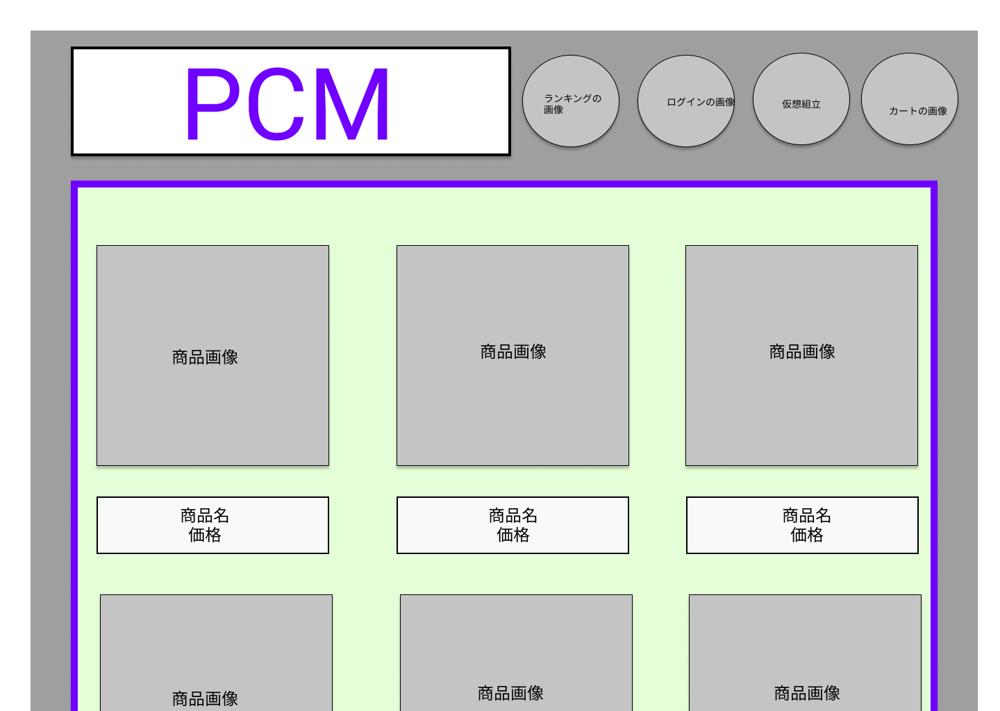

### 画面詳細図
## トップページ
### プロトタイプは以下のリンク先
[プロトタイプ](https://www.figma.com/file/0vRBRSAXa1cN6c6JlbLsOO/Untitled?node-id=0%3A1)
*****

*****

|ID|内容|要素|アクション|イベント|対応DB|
|--|---|-----|----------|-------|------|
|1|バナー|サイト名表示|商品一覧に遷移|-|-|
|2|ログイン|テキスト画像|-|-|-|
|3|ログインボタン|ボタン|クリック|ログイン処理実行|-|
|4|商品検索|テキスト画像|-|-|-|
|5|商品名|テキスト表示|-|-|-|
|6|検索|ボタン|クリック|検索処理実行|-|
|7|カート|画像ボタン|クリック|カート画面へ遷移|-|
|8|仮想組立|画像ボタン|クリック|組立画面へ遷移|-|
|9|登録情報|画像ボタン|クリック|登録情報へ遷移|-|
|10|商品一覧|テキスト表示|-|-|-|
|11|商品画像|画像リンク|クリック|商品詳細へ遷移|-|
|12|商品名|テキストリンク|クリック|商品詳細へ遷移|-|
|13|価格|テキスト表示|-|-|-|
|14|ランキング|画像ボタン|クリック|ランキング画面へ遷移|-|
